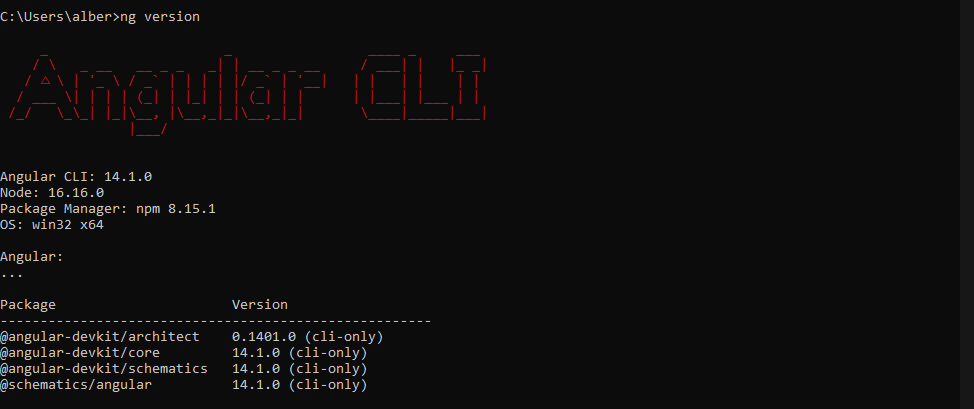
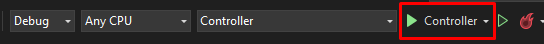

# SoftwareDeveloperTest

Para el uso de la herramiento se debe tener instalado en primer lugar NPM, para windows se puede descargar
desde la siguiente URL: 

`
https://nodejs.org/es/
`

Luego para el uso de Angular se debe tener instalado el Angular CLI, para esto se debe ejecutar el siguiente
comando 

`
npm install -g @angular/cli
`

Posteriormente para válidar la instalación de Angular de se debe usar el comando 

`
ng version
`

Se debería ver algo como esto

Tambien se podrá ver si el node quedó correctamente instalado.

Luego se debe ejecutar el archivo *.sln en el Visual Studio y marcar como proyecto de inicio el "Controller"
para posteriormente ejecutar.

El sistema no debería presentar problemas al ejecutarse.